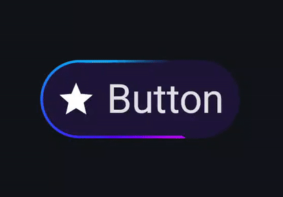

# Gradient Animated Button

A smooth, animated gradient button built with **Jetpack Compose** — inspired by the Gemini button seen on LinkedIn.

## Introduction

This is a customizable and animated button component designed with a rotating sweep gradient effect, hover/press states, and smooth scaling interaction. Perfect for adding that extra bit of ✨ flair to your Compose UI.

Lightweight, responsive, and easy to integrate into any Android project.

---

Feel free to fork, play around, and suggest improvements!

